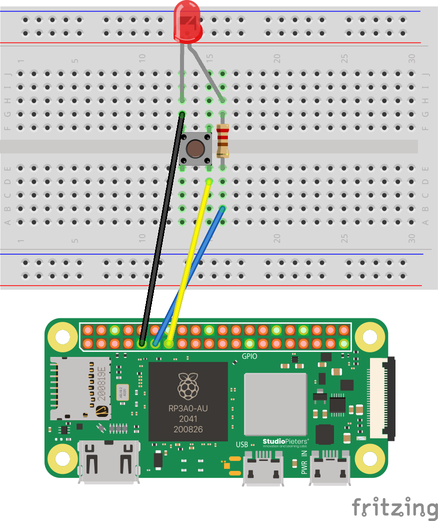

# Hello GPIO

This example demonstrates how to use General-Purpose Input/Output (GPIO) pins as
digital inputs and outputs using the [`circuits_gpio`
library](https://github.com/elixir-circuits/circuits_gpio).

The example uses two separate circuits:

* The first circuit contains an LED (Light-Emitting Diode) that is turned on and off by Elixir controlling a GPIO pin.
* In the second circuit, Elixir monitors a GPIO pin and logs the changing state of a manual switch.

## Hardware

For the output pin, you will need a single LED with it's catode (short leg) connected to GND and it's anode (long leg) connected to GPIO pin 17 with a 220-330 Ω resistor in series.
* The resistor prevents the LED from drawing too much current and burning up your LED.
* As an experiment, you can increase the value of the resistor, and you will notice that the LED will be dimmer than before, as the current will be reduced.
* If you do not see the light turning on and off, it is likely that you have plugged the LED in backwards. The LED only allows current to flow in one direction.


For the input pin, connect a 4-pin push-button to GPIO pin 27.
* The pull up resistor prevents you from entering a floating state (not knowing if the button has been pressed or not)
* When the button is not pressed, the GPIO will register a high value (close to 3.3V).
* When the button is pressed, the current will flow from 5V to ground, and the GPIO will register a low value (close to 0V).



The default configuration uses GPIO BCM pin 17 for output and GPIO BCM pin 27
for input.  Note that you are using the labeled BCM pins as found on a Raspberry
Pi as shown in the diagram at [pinout.xyz](https://pinout.xyz).


## How to Use the Code in this Repository

1. Connect the hardware according to the schematic above
2. Configure which pins to use to use by editing `config/config.exs`
3. Specify your target with the `MIX_TARGET` environment variable
4. Get dependencies with `mix deps.get`
5. Create firmware with `mix firmware`
6. Burn firmware to an SD card with `mix firmware.burn`
7. Connect a monitor to the HDMI port on the board
8. Insert the SD card into your target board and power it on
9. After about 5 seconds, the LED should start blinking
10. Enter `RingLogger.attach` at the IEx prompt in the console
11. On the monitor you will see log entries showing the status of the LED.
    Pressing the switch button will display entries showing the changing state
    of the switch

```bash
# Make sure you use the right MIX_TARGET for your board
export MIX_TARGET=rpi0
mix deps.get
mix firmware
mix firmware.burn
```

## Learn More

* Official docs: https://hexdocs.pm/nerves/getting-started.html
* Official website: https://nerves-project.org/
* Discussion Slack elixir-lang #nerves ([Invite](https://elixir-slackin.herokuapp.com/))
* Source: https://github.com/nerves-project/nerves
