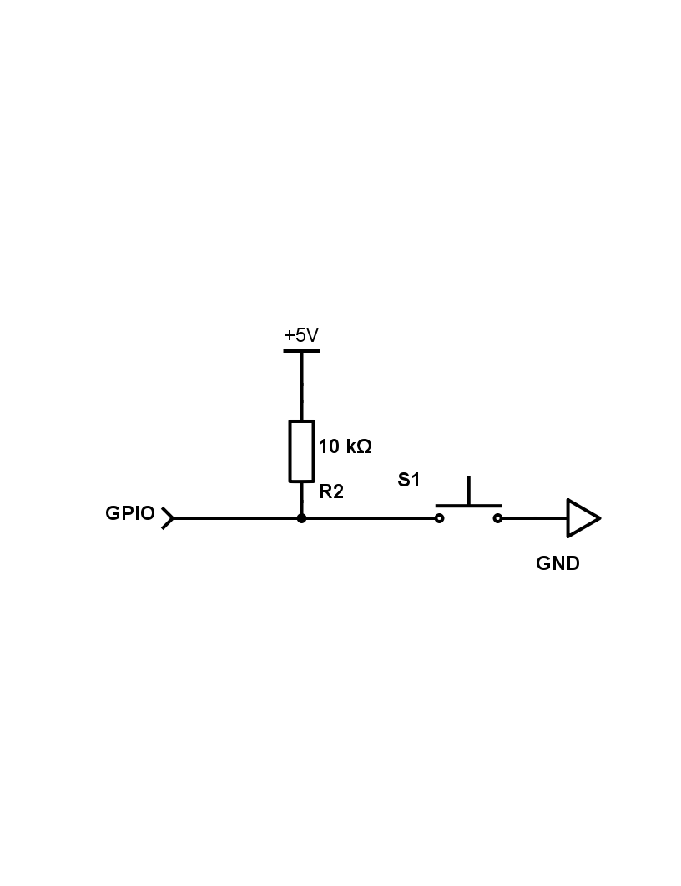

# Hello GPIO Input

This example demonstrates how to use General-Purpose Input/Output (GPIO) pins as digital inputs using the `elixir_ale` library.

## Hardware

Connect a 4-pin push-button with a 10 kΩ pull-up resistor to a GPIO pin.

Schematic:



The default configuration uses GPIO pin 26, which can be found on a Raspberry Pi using the following diagram from https://pinout.xyz:


## How to Use this Repository

1. Connect the hardware according to the schematic above
2. Configure which input pin to use by editing `config/config.exs`
3. Specify your target with the `MIX_TARGET` environment variable
4. Get dependencies with `mix deps.get`
5. Create firmware with `mix firmware`
6. Burn firmware to an SD card with `mix firmware.burn`
7. Connect a monitor to the HDMI port on the board
8. Insert the SD card into your target board and power it on
9. After it finishes booting (about 5 seconds), pressing the button will log events to the console on the HDMI monitor

``` bash
export MIX_TARGET=rpi3
mix deps.get
mix firmware
mix firmware.burn
```

## Learn more

  * Official docs: https://hexdocs.pm/nerves/getting-started.html
  * Official website: http://www.nerves-project.org/
  * Discussion Slack elixir-lang #nerves ([Invite](https://elixir-slackin.herokuapp.com/))
  * Source: https://github.com/nerves-project/nerves
