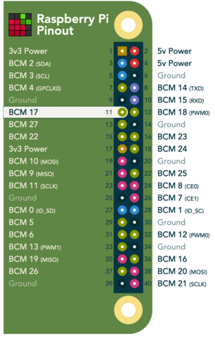

# Hello WiFi

This example builds a Nerves firmware image for supported Nerves devices that
demonstrates using [`VintageNetWizard`](https://hexdocs.pm/vintage_net_wizard)
WiFi configuration utility. The wizard will run on boot and also after a button
has been held down for 5 seconds.

If you don't have a button, you can use a jumper wire to temporarily connect
3.3V power directly to the pin (the default is GPIO 17 which is pin 11 on the
Raspberry Pi's GPIO header).

[](https://pinout.xyz/#)

If you have a Raspberry Pi hat with a button connected to a different GPIO pin,
you can specify which pin to use in your config:

```elixir
config :hello_wifi, button_pin: 27
```

If you're not using a Raspberry Pi, then modify the pin number to a GPIO that
makes sense on your board.

The next step is to build the firmware. Make sure that you've installed Nerves
and run the following:

```sh
cd hello_wifi

# Set the target to rpi0, rpi3, or rpi4 depending on what you have
export MIX_TARGET=rpi3
mix deps.get
mix firmware

# Insert a MicroSD card or whatever media your board takes
mix burn
```

Place the MicroSD card in the Raspberry Pi and power it on. You should see a
WiFi access point appear with the SSID "*hello_wifi*" that you should connect
to.  Once connected, a captive portal dialog screen should come up with the
configuration page. If it doesn't for some reason, you can also get to the page
manually from the browser at either of these addresses:

* [http://hello_wifi.config](http://hello_wifi.config/)
* [http://192.168.0.1/](http://192.168.0.1/)

Note: The SSID and DNS name can be changed in `config/target.exs`

```elixir
config :vintage_net_wizard,
  ssid: "my_ssid",
  dns_name: "some.site"
```
